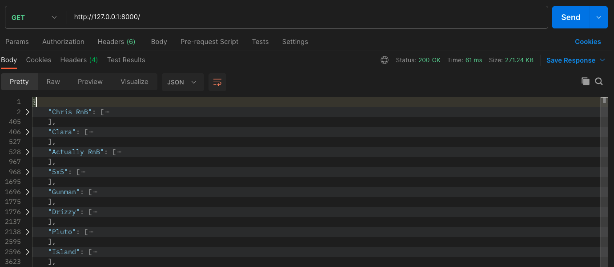
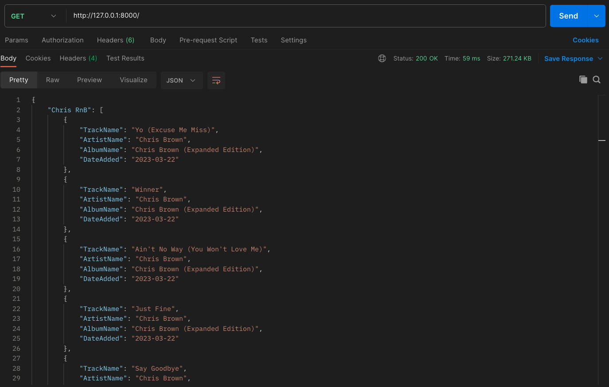
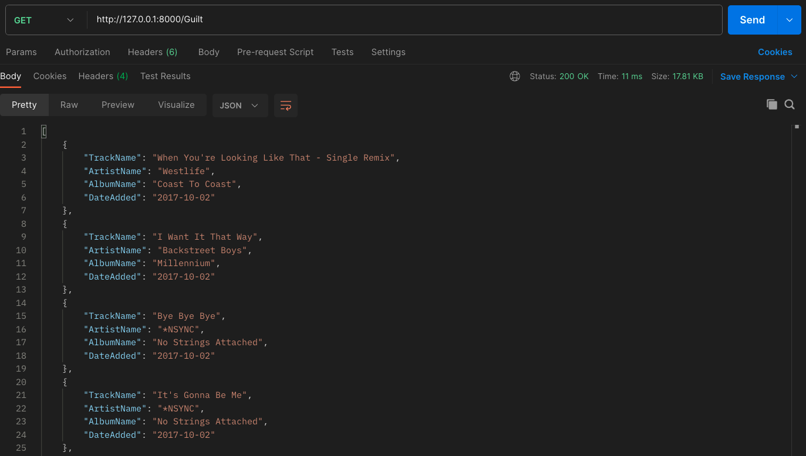
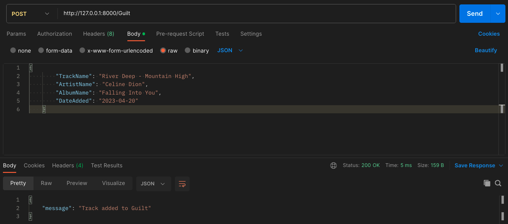
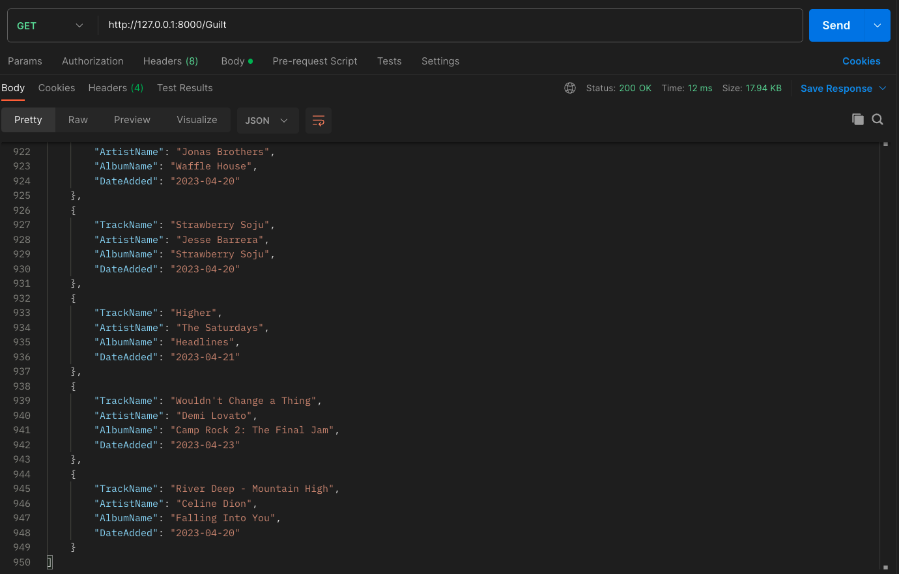

# FastAPI

FastAPI is a framework in Python used to build APIs

API stands for Application Programming Interface

- A software intermediary that allows two applications to talk to each other.

## Env Setup

Install packages:

```
pip install "fastapi[all]"
```

To run the server:

```
uvicorn main:app --reload
```

`uvicorn` is a server that hosts our FastAPI appliction.
`main:app` is the command to call our application, `main` is the file name and `app` is the instance of FastAPI defined.

The `--reload` option automatically reloads the server when there are code changes, similar to `app.run(debug=True)` in Dash

## 🎧 Project

The project here is to take data I requested from my Spotify account.

The csv file in [data](/data/) has all tracks I have in my playlists. The aim is to expose an API where I can view the data but also filter the tracks based on the playlist it resides in.

---

### GET

Below shows the inital output when we expose the data

|   Collapsed Playlists   |      Expanded View       |
| :---------------------: | :----------------------: |
|  |  |

Then, when we want to fiiter the tracks to only those in the _Guilt_ playlist:



---

### POST

I also built in the capability to add to the data.

| Input Body and Post Message |       Confirmation       |
| :-------------------------: | :----------------------: |
|           |  |
